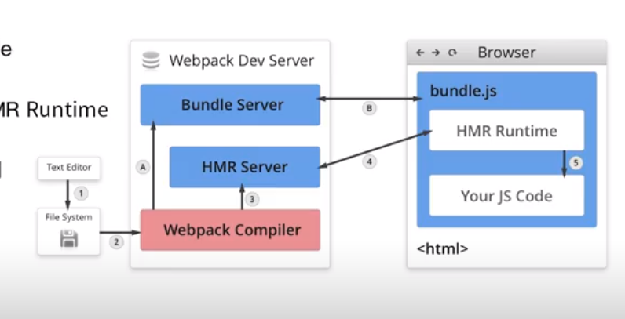

## `loader`
```js
class MyPlugin {
  constructor (options) {
    console.log('myPlugin constructor:', options)
  }
  apply(compiler) {
    compiler.hooks.compilation.tap('ChunkFromPreload', (compilation) => {
      compilation.hooks.htmlWebpackPluginAlterAssetTags.tap(
        'chunksFromPreload',
        (htmlPluginData) => {
          htmlPluginData.body = [];
          htmlPluginData.head.map(tag => (
            tag.attributes.rel === 'preload' && tag.attributes.as === 'script'
          ))
          .filter(src => typeof src === 'string')
          .forEach((src) => {
            htmlPluginData.body.push({
              tagName: 'script',
              closeTag: true,
              attributes: {type: 'text/javascript', src}
            })
          })
          return htmlPluginData;
        }
      )
    })
  }
}
```

## loader和plugin
loader: 把loader理解为是一个转换器，负责把某种文件格式的内容转换为webpack可以支持打包的模块
plugin: 在用于webpack打包编译过程里，在对应的事件节点里执行自定义操作，

## 监听原理
不断轮询看文件是否更新
发现更新后并不是马上重新打包，需要等一段时间后和其他文件一起打包

## webpack-dev-middleware
可以实时把文件上传到服务器

## 热更新原理
HMR Server 把更新的文件传输给HMR Runtime
Bundle server 提供文件在浏览器访问
HMR Runtime: 会被注入到浏览器，更新文件的变化

首次启动webpack先打包文件为bundle, 让Bundle Server以服务器的方式访问文件
然后当第二次更新的时候，打包后文件然后HMR Server收到打包好的文件主要想HMR
runtime推送文件，然后HMR runtime完成文件的替换，实现更新


## webpack流程

1. 初始化参数: 从配置文件和shell语句中读取与合并参数，得出最终的参数
2. 开始编译: 用上一步得到的参数初始化Compiler对象，加载所有配置的插件，执行对象的run方法开始执行编译
3. 确定入口: 根据配置中的entry找出所有的入口文件
4. 编译模块: 从入口文件触发，调用所有配置的loader对模块进行翻译，在找出该模块所依赖的模块，在递归调用本步骤知道所有入口依赖的文件都经过了本步骤的处理
5. 完成模块编译: 在经过loader翻译完所有模块后，得到了每个模块被编译后的最终内容以及它们之间的依赖关系
6. 输出资源: 根据入口和模块之间的依赖关系，组装成一个个包含多个模块的chunk，再把每个chunk转换为一个单独的文件加入到输出列表，这步是可以修改输出内容的最后机会
7. 输出完成： 在确定好输出内容后，根据配置确定输出的路径和文件名，把文件内容写入到文件系统中。

## 模块化原理
```js
var installedModules = {};
function __webpack_require__(moduleId) {
  // 判断是否已缓存模拟
  if (installedModules[moduleId]) {
    return installedModules[moduleId].exports
  }
  // 缓存模块
  var mod
  ule = installedModules[moduleId] = {
    i: moduleId,
    l:false,
    exports: {},
  }
  // 调用模块函数
  modules[moduleId].call(module.exports, module, module.exports, __webpack_require__);
  // 标记模块为已加载
  module.l = true;
  // 返回module.exports
  return module.exports;
}
return __webpack_require__(__webpack_require__.s = 0)
```
```js
__webpack_require__.e = function requireEnsure(chunkId) {
  // 缓存查找
  var installedChunkData = installedChunks[chunkId];
  if (installedChunkData === 0) {
    return new Promise(function (resolve) { resolve(); })
  }
  if (installedChunkData) {
    return installedChunkData[2]
  }
  // 2、缓存模块
  var promise = new Promise(function(resolve, reject) {
    installedChunkData = installedChunks[chunkId] = [resolve, reject]
  })
  installedChunkData[2] = promise;
  // 加载模块
  var head = document.getElementsByTagName('head')[0];
  var script = document.createElement('script');
  script.type = 'text/javascript';
  script.charset = 'utf-8';
  script.async = true;
  script.timeout = 12000;
  if (__webpack_require__.nc) {
    script.setAttribute('nonce', __webpack_require__.nc)
  }
}
```
### loader的编写
```js
module.exports = function(source) {
  this.callback(null, source)
  return;
}
```

### webpack的优化策略
1. 优化resolve.modules配置，指明第三方模块存放的位置，已减少搜索步骤
2. 优化loader配置 // 需要让尽可能少的文件被操作
3. 优化resolve.extensions
4. 优化module.noParse： 可以让webpack忽略对部分没采用模块化的
文件的递归解析处理
5. 使用DLLPlugin: 大量复用模块的动态链接库只需要编译一次，在之后的构建过程中被动态链接库包含的模块不会重新编译
6. 使用happyPack，他将任务分解给多个字进程去并发执行，字进程处理完成以后再将结果发送给主进程
7. 使用parallelUglifyPlugin进行并行压缩
8. 优化文件监听的性能
  忽略node_modules下的文件
  watcherOptions.aggregateTimeout的值越大越好，这能降低重新构建的频率
  watcherOptions.poll的值越小越好，这能降低检查的频率
9. cdn加速
10. 使用tree-shaking: 针对npm中的第三方模块，优先采用jsnext:main中指向的es6模块化语法的文件，使用tree shaking优化 mainFields
11. 提取公共代码
12. 代码分割
13. prepack
14. scope hoisting

### webpack的工作原理:
entry: 入口
module: 在webpack中一切皆模块，一个模块对应一个文件。webpack会从配置的entry开始，递归找出所有依赖的模块
chunk: 代码块，一个chunk由多个模块组合而成，用于代码合并和分割
loader: 模块转换器
Plugin: 扩展插件

Compiler是一个编译器实例
Compilation: 
  modules: 记录了所有解析后的模块
  chunks： 记录了所有的chunk
  assets: 记录了所有要生成的文件

## webpack的code-split原理


(function(modules) { // webpackBootstrap
    // install a JSONP callback for chunk loading
    var parentJsonpFunction = window["webpackJsonp"];
    window["webpackJsonp"] = function webpackJsonpCallback(chunkIds, moreModules, executeModules) {
        // add "moreModules" to the modules object,
        // then flag all "chunkIds" as loaded and fire callback
        var moduleId, chunkId, i = 0, resolves = [], result;
        for(;i < chunkIds.length; i++) {
            chunkId = chunkIds[i];
            if(installedChunks[chunkId]) {
                resolves.push(installedChunks[chunkId][0]);
            }
            installedChunks[chunkId] = 0;
        }
        for(moduleId in moreModules) {
            if(Object.prototype.hasOwnProperty.call(moreModules, moduleId)) {
                modules[moduleId] = moreModules[moduleId];
            }
        }
        if(parentJsonpFunction) parentJsonpFunction(chunkIds, moreModules, executeModules);
        while(resolves.length) {
            resolves.shift()();
        }
    };
    // The module cache
    var installedModules = {};
    // objects to store loaded and loading chunks
    var installedChunks = {
        2: 0
    };
    // The require function
    function __webpack_require__(moduleId) {
        // Check if module is in cache
        if(installedModules[moduleId]) {
            return installedModules[moduleId].exports;
        }
        // Create a new module (and put it into the cache)
        var module = installedModules[moduleId] = {
            i: moduleId,
            l: false,
            exports: {}
        };
        // Execute the module function
        modules[moduleId].call(module.exports, module, module.exports, __webpack_require__);
        // Flag the module as loaded
        module.l = true;
        // Return the exports of the module
        return module.exports;
    }
    // This file contains only the entry chunk.
    // The chunk loading function for additional chunks
    __webpack_require__.e = function requireEnsure(chunkId) {
        var installedChunkData = installedChunks[chunkId];
        if(installedChunkData === 0) {
            return new Promise(function(resolve) { resolve(); });
        }
        // a Promise means "currently loading".
        if(installedChunkData) {
            return installedChunkData[2];
        }
        // setup Promise in chunk cache
        var promise = new Promise(function(resolve, reject) {
            installedChunkData = installedChunks[chunkId] = [resolve, reject];
        });
        installedChunkData[2] = promise;
        // start chunk loading
        var head = document.getElementsByTagName('head')[0];
        var script = document.createElement('script');
        script.type = 'text/javascript';
        script.charset = 'utf-8';
        script.async = true;
        script.timeout = 120000;
        if (__webpack_require__.nc) {
            script.setAttribute("nonce", __webpack_require__.nc);
        }
        script.src = __webpack_require__.p + "" + ({"0":"foo","1":"bar"}[chunkId]||chunkId) + ".bundle.js";
        var timeout = setTimeout(onScriptComplete, 120000);
        script.onerror = script.onload = onScriptComplete;
        function onScriptComplete() {
            // avoid mem leaks in IE.
            script.onerror = script.onload = null;
            clearTimeout(timeout);
            var chunk = installedChunks[chunkId];
            if(chunk !== 0) {
                if(chunk) {
                    chunk[1](new Error('Loading chunk ' + chunkId + ' failed.'));
                }
                installedChunks[chunkId] = undefined;
            }
        };
        head.appendChild(script);
        return promise;
    };
    // expose the modules object (__webpack_modules__)
    __webpack_require__.m = modules;
    // expose the module cache
    __webpack_require__.c = installedModules;
    // define getter function for harmony exports
    __webpack_require__.d = function(exports, name, getter) {
        if(!__webpack_require__.o(exports, name)) {
            Object.defineProperty(exports, name, {
                configurable: false,
                enumerable: true,
                get: getter
            });
        }
    };
    // getDefaultExport function for compatibility with non-harmony modules
    __webpack_require__.n = function(module) {
        var getter = module && module.__esModule ?
            function getDefault() { return module['default']; } :
            function getModuleExports() { return module; };
        __webpack_require__.d(getter, 'a', getter);
        return getter;
    };
    // Object.prototype.hasOwnProperty.call
    __webpack_require__.o = function(object, property) { return Object.prototype.hasOwnProperty.call(object, property); };
    // __webpack_public_path__
    __webpack_require__.p = "";
    // on error function for async loading
    __webpack_require__.oe = function(err) { console.error(err); throw err; };
    // Load entry module and return exports
    return __webpack_require__(__webpack_require__.s = 0);
})
([
(function(module, exports, __webpack_require__) {
    "use strict";
    __webpack_require__.e/* import() */(0).then(__webpack_require__.bind(null, 1)).then(foo => {
        console.log(foo());
    })
    __webpack_require__.e/* import() */(1).then(__webpack_require__.bind(null, 2)).then(bar => {
        console.log(bar());
    })
})
]);


## 面挂的公司

百度、猿辅导、腾讯

面过的公司:
头条、快手、好未来、跟谁学、玩吧、美团
