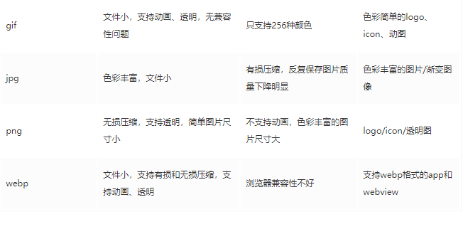

白屏时间计算方法:
认为body标签或者解析完head表标签的时刻就是页面白屏结束的时间
计算通过performance
domloading - fetchStart

首屏时间:
1. 首屏模块标签标记法
2. 统计首屏内图片完成加载的事件

完全可交互时间


图片的优化策略


## dns-prefetch preconnect
如果站点是通过https服务的，但此过程包含DNS解析，建立TCP连接已经执行TLS握手
```css
<link >
```
