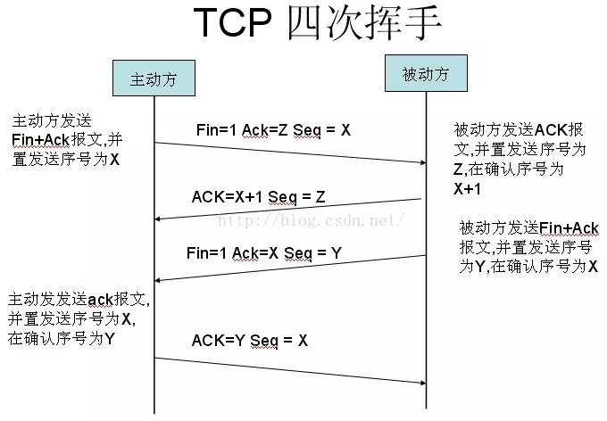
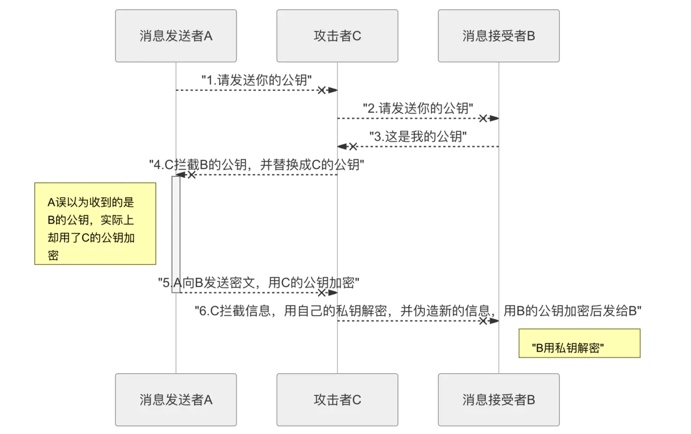
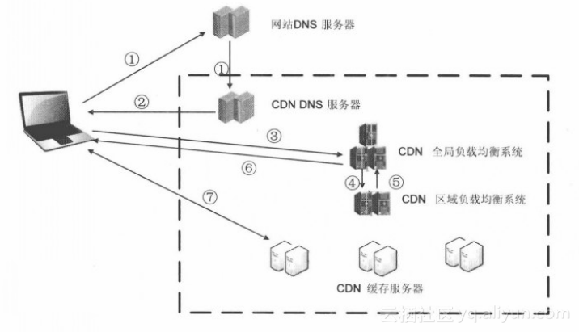

## TCP三次握手、四次挥手
[](https://juejin.im/post/5a0444d45188255ea95b66bc)
tcp三次挥手用于建立连接
为什么要用三次握手: 已失效的连接请求报文段
tcp四次挥手用于断开连接
### 三次握手

三次握手的目的是连接服务器指定端口，建立TCP连接，并同步连接双方的序列号和确认好并交换TCP窗口大小信息
1. 客户端发送syn报文、seq序列号
2. 服务端发送syn报文、ack报文、seq序列号
3. 客户端发送ack、seq报文
### 四次挥手

1. 主动方发送fin+ack报文 seq序号
2. 被动方发送ack报文，seq序号
3. 被动方发送ack fin报文，seq序号
4. 主动方发送ack报文，seq序号
当收到对方的fin报文时，仅表示对方不在发送数据但是还能接受数据，已方也未必全部数据都发送给对方了，所以已方可以立即close，也可以发送一段数据后在发送fin报文给主动方同意数据关闭
## HTTP
[](https://juejin.im/post/5cd0438c6fb9a031ec6d3ab2#heading-5)
http1.1: 使用keep-alive来实现同一个tcp上建立多个http连接
http2: 多路复用
### 缓存
()[https://juejin.im/post/5b3c87386fb9a04f9a5cb037]
Expires: 资源过期时间 可能存在本地时间被更改的情况
Cache-Control: 精确控制缓存策略
If-Modified-Since: 资源最近修改时间，浏览器告诉服务器
Last-Modified: 资源最近修改时间，由服务器告诉浏览器
  如果服务端文件频繁更改保存，那么last-modified就会修改
Etag: 资源标识，由服务器告诉浏览器
If-None-Match: 缓存资源标识，由浏览器告诉服务器
### 强缓存&协商缓存
强缓存: 不会发生请求
强制缓存在缓存数据未失效的情况下，不需要和服务器发生交互
过期时间后，如果文件没有改动，再去获取文件就有点浪费服务器的资源
cache-control&expires
协商缓存: 会发起一次请求
需要比较判断是否可以使用缓存
第一次请`求Last-Modified ||     Eag`，后续请求会加上`if-Modified-Since || if-None-Match`
### 状态码
2xx: 成功
3xx：重定向
301: 永久重定向
302：暂时重定向
304: 服务器允许访问资源，但因发生请求为满足条件的情况
403: 请求资源的访问被浏览器拒绝
404: 服务器上没有找到请求的资源
500：服务器在执行请求上发生了错误
503：服务器无法处理请求
### 请求头部
host: 请求的服务器地址
User-Agent: 发送请求的应用程序名称
Connection: 指定与连接相关的属性
Accept-Charset: 通知服务端可以发送的编码格式
Accept-Encoding: 通知服务端可以发送的数据压缩格式
Accept-Language: 通知服务端可以发送的语言
### 响应头部
Server：服务器应用程序软件名称和版本
Content-Type: 响应正文的类型
Content-Length: 响应正文长度
Content-Charset: 响应正文使用的编码
Content-Encoding: 数据压缩格式
Content-Language: 响应正文使用的语言
### http2的优势
http/1 每次请求都需要建立一个单独的连接，单独的连接需要tcp三次握手四次挥手
http/1.1 keep-alive 一次tcp可以建立多个http连接
问题: 
  串行的文件传输
HTTP2的多路复用:
  通过流的方式传递数据，一个tcp可能存在多条流
### 多路复用
多个请求变成多个流，请求响应数据分成多个帧，不同流中的帧交错的发送给对方
## 从输入URL到页面加载发生了什么
1. DNS解析
  网址到ip地址的转换
  浏览器缓存、系统缓存、路由器缓存、IPS服务器缓存、根域名服务器缓存、顶级域名服务器缓存、主域名缓存
2. TCP连接
3. 发送HTTP请求
4. 服务器处理请求并返回HTTP报文
5. 浏览器解析渲染页面
6. 连接结束

## 缓存问题

```
list: [
  {
    label: '全部',
    value: ''
  }
]

this.list = this.list.concat(data)
```
## http1为什么不能实现多路复用
http/1.1不是不进制传输，而是通过文件进行传输。由于没有流的概念，在使用并行传输传递数据时，接收端在接收到响应后，并不能区分多个响应对应的请求，所以无法将多个响应的结果重新进行组装，也就实现不了多路复用
## https中间人攻击

1. A向B请求公钥，但是被C截获
2. C向B发送公钥请求
3. B向公钥发给C
4. C接活了B的公钥，然后替换成自己的公钥发给A
5. A将C的公钥当成了B的公钥，并用加密信息发给B
6. C截获了加密信息，用自己的私钥解密，获得明文。同时伪造新的信息，
在用B的公钥进行加密，发给B
7. B获得加密信息，用自己的私钥解密

## TCP连接
### 三次握手
1. 客户端发送syn=1,随机产生seq number的数据包发送到服务器，服务器由syn=1知道客户端要求建立连接
2. 服务端收到请求要确认联机信息，向A发送ack number=(客户端的seq + 1), syn=1, ack=1,随机产生seq的包
3. 客户端收到后检查ack number是否正确，即第一次发送的seq number + 1,以及位码是否为1，若正确，客户端会在发送ack number = (服务端的seq + 1), ack=1，服务器收到后确认seq值与ack=1则连接建立成功
### 四次挥手
1. client向server发送fin包，表示client主要要求关闭连接，然后进入FIN_WAIT_1状态，等待Server返回ACK包。此后client不再向Server发送数据，但能够读取数据
2. Server收到FIN包向Client发送ACK包，然后进入CLOSE_WAIT状态，此后Server不再读取数据，但可以继续向Client发送数据
3. Client收到Server返回的ACK包后进入FIN_WAIT_2状态，等待Server发送FIN包
4. Server完成数据的发送后，把FIN包发送给Client，然后进入LAST_ACK状态，等待Client返回ACK包，此后Server既不能读取数据，也不能发送数据
5. Client收到FIN包后向Server发送ACK包，然后进入到TIME_WAIT状态，接着等待足够长的事件已确保Server接收到ACK包，最后回到CLOSED状态，释放网络资源
6. Server收到Client返回的ACK包便回到CLOSED状态，释放网络资源

## 204
对于一些提交到服务器处理的数据，只需要返回是否成功的情况下，可以考虑用204，


## CDN

1. 当用户点击网络页面上内容的url, 经过本地DNS解析，DNS系统会最终将域名解析权交个CNAME指向的CDN专用DNS服务器
2. CDN的DNS服务器将CDN的全局负载均衡设置IP地址返回给用户
3. 用户向CND的全局负载均衡设备发起内容URL访问请求
4. CDN全局负载均衡设备根据用户IP地址，以及用户请求的内容URL，选择一台用户所属区域负载均衡设备，告诉用户向这台设备发起请求
5. 区域负载均衡设备会为用户选择一台合适的缓存服务器提供服务，选择的依据包括: 根据用户IP地址，判断那一台服务器距离用户最近；根据用户所请求的URL中携带的内容名称，判断哪一台服务器上有用户所需内容；查询各个服务器当前的负载情况，判断哪一台服务器尚有服务能力。
6. 全局负载均衡设备把服务器的IP地址返回给用户
7. 用户向缓存服务器发起请求，缓存服务器响应用户请求，将用户所需内容发送到用户终端。如果这台缓存服务器上并没有用户想要的内容，而均衡设备依然将他分配给了用户，那么这台服务器就要像他的上一级缓存服务器请求内容，直到源服务器

## NGINX有哪些作用
1. 静态HTTP服务器: Nginx是一个HTTP服务器，可以将服务器上的静态文件通过HTTP协议展现给客户端
2. 反向代理: 客户端可以通过HTTP协议访问某网站应用服务器，网站管理员可以在中间加上一个NGINX，客户端请求NGINX，客户端请求NGINX，NGINX请求应用服务器，然后将结果返回给客户端，此时NGINX就是反向代理服务器
3. 负载均衡: 一个请求可能会通过不同的服务器进行处理
4. 虚拟主机：多个网站部署在同一台服务器上

## 网络协议分为哪一层
物理层、连接层、网络层、传输层、应用层
